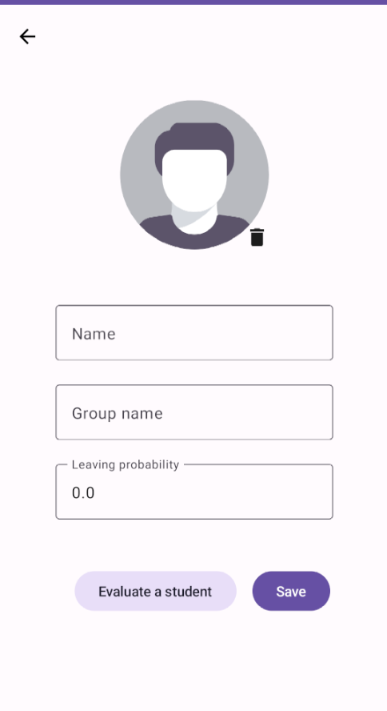
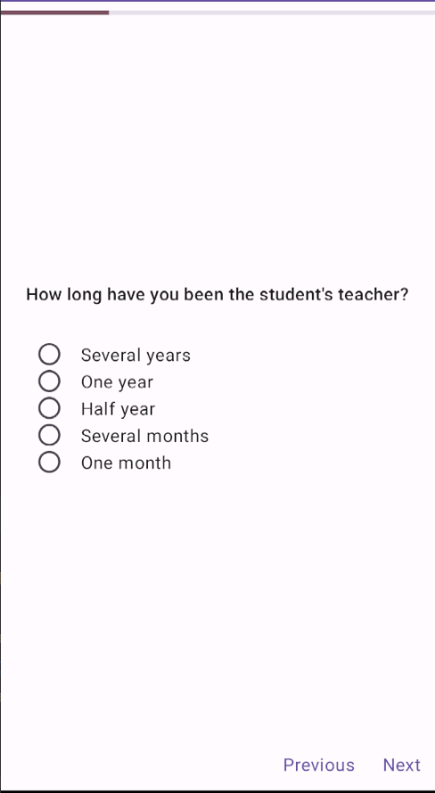

# Happy Student App

|  Main Screen  |       Add Student Screen       |            Survey Screen            |
|:-------------:|:------------------------------:|:-----------------------------------:|
|  |  |   |

## Description

Happy Student application was created for the private school teachers. It helps to check students satisfaction with education and prevent leaving before course end.

Teachers can take a survey to evaluate leaving probability. 

## Features

- list of students (name, group, leaving probability, last update, avatar)
- student filters: by priority, groups
- student list sharing
- add a student
- add a group of students (batch adding)
- evaluating survey
- add student photo, avatar

## Future Features

- recommendations to prevent leaving
- create own survey
- authorization and user profile
- backend and networking

## Tech Stack and Architecture

- Kotlin
- MVVM, ViewModel with one state property (sealed class), UDF, Google Architecture Guidelines. See: 

[Modern Android App Architecture](https://developer.android.com/courses/pathways/android-architecture)

[Recommendations for Android architecture](https://developer.android.com/topic/architecture/recommendations)

[Common modularization patterns](https://developer.android.com/topic/modularization/patterns)

- Coroutines, Flow, StateFlow
- Jetpack Compose, Compose Navigation
- Room Database
- Proto Datastore
- Jetpack ViewModel, Lifecycle
- Dagger-Hilt
- Coil (Image Loading)

## Demo

[Happy Student Demo](https://youtu.be/xO_RSHE3R2k)

## Contacts

- mark130599@gmail.com
- Telegram: @mark_gardie
- [Linkedin](https://www.linkedin.com/in/mark-gardie/)
- [Djinni](https://djinni.co/q/e6084e6678/)
